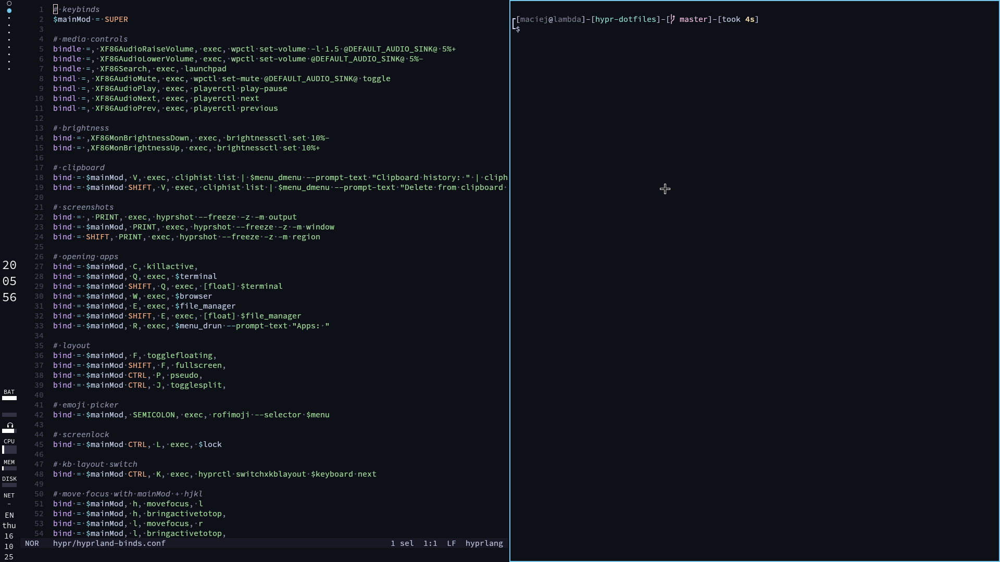
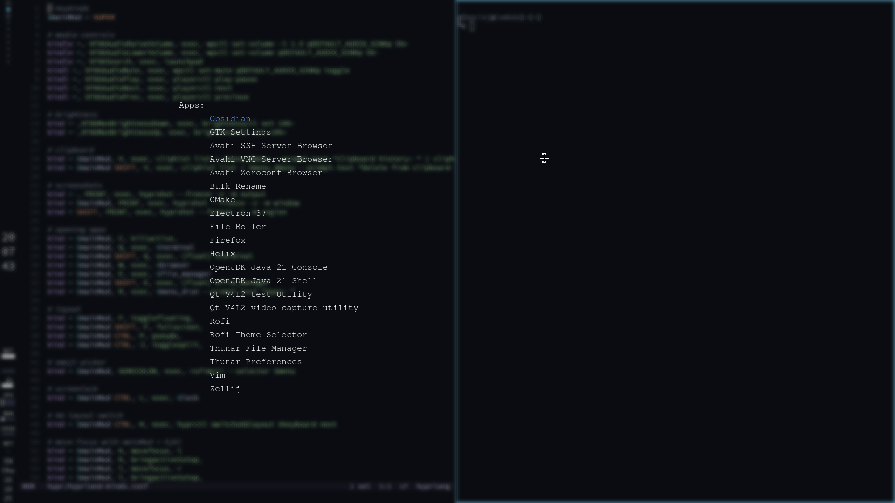

# Hyprland config

## Showcase

## Dependencies

- [brigthnessctl](https://github.com/Hummer12007/brightnessctl)
- [eww](https://github.com/elkowar/eww)
- [hypridle](https://github.com/hyprwm/hyprutils)
- [hyprland](https://github.com/hyprwm/Hyprland)
- [hyprlock](https://github.com/hyprwm/hyprlock)
- [hyprpolkitagent](https://github.com/hyprwm/hyprpolkitagent)
- [hyprshot](https://github.com/Gustash/Hyprshot)
- [mako](https://github.com/utooland/utoo)
- [pamixer](https://github.com/cdemoulins/pamixer)
- [playerctl](https://github.com/altdesktop/playerctl)
- [rofimoji](https://github.com/fdw/rofimoji)
- [swww](https://github.com/LGFae/swww)
- [socat](http://www.dest-unreach.org/socat/)
- [tofi](https://github.com/philj56/tofi)
- [wl-clipboard](https://github.com/bugaevc/wl-clipboard)
- [wlsunset](https://github.com/kennylevinsen/wlsunset)
